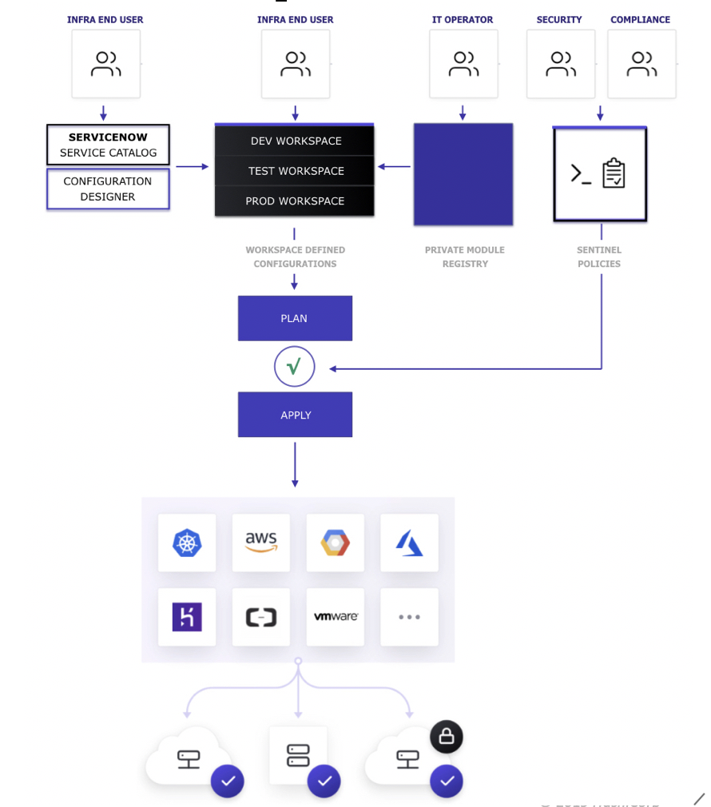
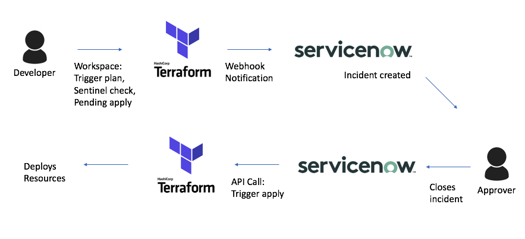
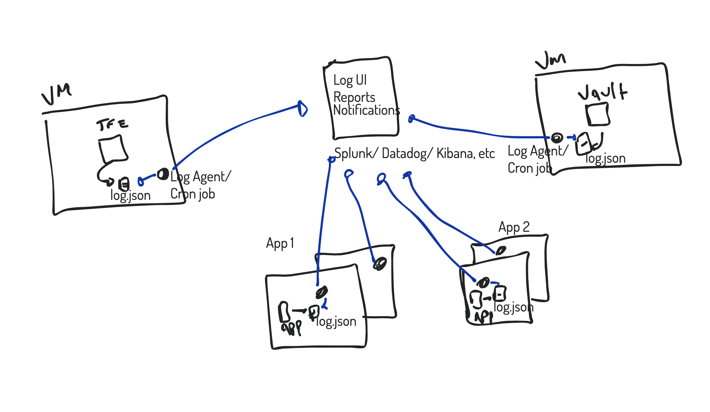

# TFE PoC 

## Test Cases

### Workspace Workflow
#### Setup VCS integration
Follow steps for desired VCS here:
https://www.terraform.io/docs/cloud/vcs/index.html

#### Workspace configuration
1. Open TFE in the browser (http://TFE_SERVER)
2. Login with admin user
3. Click on "New workspace"
4. Select desired VCS connectivity
5. Select a repository
6. Enter name
7. (Optional) Specify folder containing terraform code
8. (Option) Specify branch to track
9. Click Ok
10. Enter any variables needed

#### Validation
1. Run execution manually by pressing the button
2. Push a change to the branch of the git repo being tracked (master is default) and see the execution is triggered

---
### Basic Workflow
#### Modules
1. Find public module, or create one
```
Example: https://github.com/terraform-aws-modules/terraform-aws-vpc.git
https://github.com/stenio123/terraform-demo-module-vpc
# If desired, you can execute the following to remove external git references
rm -rf .git
```
2. Remove old git references and create a new git repo with this module
3. Point TFE to this module
4. Make sure there is version tag to track lifecycle
```
git tag v1.0.0
git push --tag
```
#### Sentinel
1. Create a repository or folder to track sentinel policies
```
Example: https://github.com/hashicorp/terraform-guides/tree/master/governance/second-generation
https://github.com/stenio123/TFE_PoC2/tree/master/sentinel/terraform
```
2. Talk about the code - rules and sentinel.hcl
3. Create policy set in TFE
4. Execute to "all workspaces"
5. Show the results when failed execution

#### Workspaces
Siga el ejemplo
---
### Terraform Code Review +
1. Terraform Enterprise allows segregation of roles, with team members responsible for creating and managing modules, creating and managing Sentinel policies and creating and managing Terraform code.

Workflow


2. Terraform code can be a living, evolving document. Usually it starts with all resources in the same file, and eventually as complexity grows, the team can identify areas that can be separated into independent files or in external modules.
3. Terraform will look for all files with .tf extension in a folder, and create a dependency graph internally to help it decide in which sequence resources will be created. Beacuse of that, it doesnt matter if all resources are in a main.tf or in multiple files (main.tf, network.tf, security.tf, etc).
4. Using modules is a best practice in enterprise because it allows code reuse and enforcing compliance and best practices.
5. Workflows for the Private Module Registry and for Sentinel will have their own test cases.
---
### Modules Best Practices +
1. Try to have module hierarchy as flat as possible, at most 3-layer depth to reduce complexity
2. Use a composition pattern, where many smaller modules can be assembled as needed, reducing depedencies and increasing reuse
3. Reference on composition and abstracting objects within modules: https://www.terraform.io/docs/modules/composition.html
4. You can also automate the workspace creation by using the TFE workspace creator
https://github.com/vincentramirez/creator (and financial institution reference)


---
### Controlling Permissions in Terraform
1. On the TFE browser, go to "Settings" and create three groups: "admin", "users" and "superusers". 
2. Create three users, and assign each one to each of these groups
3. Go to the workspace created in the previous example, go to "Settings"> "Permissions" and assign the following permissions: "admin" has admin rights, "users" can plan and "superusers" can apply
4. Log out of the admin user and log in with each one of the 3 users created, validating that their permissions are constrained by which group they are in

#### SAML Integration

These docs describe the steps to configure integration with Active Directory, Okta and OneLogin:
https://www.terraform.io/docs/enterprise/saml/identity-provider-configuration-adfs.html

---
### Terraform Workflow - Variables
#### Manually
1. Open the workspace created above
2. Change variables
3. Run a plan to validate changes

#### Terraform Enterprise Provider
1. Do one example using Terraform Enterprise provider
https://www.terraform.io/docs/providers/tfe/index.html
Will need a user token, workspace id, tfe url, tfe certificate
Test: [tfprovider.md](variablestesting/tfprovider.md)

#### Terraform Enterprise API
1. Do one example using Terraform Enterprise API
https://www.terraform.io/docs/cloud/api/variables.html
it will need a user token, workspace id, tfe url, tfe certificate
Test: [api.md](variablestesting/api.md)
---
### Integration with Azure KeyVault and Vault +
1. Ensure Terraform code using the two resources:
#### Azure KeyVault
https://www.terraform.io/docs/providers/azurerm/r/key_vault.html
Needs Azure API keys
Test: [azurekeyvault.tf](azurekeyvault/azurekeyvault.tf)

#### Vault
https://www.terraform.io/docs/providers/vault/index.html
Needs Vault token with sufficient permissions
Test: [vaultintegration](vaultintegration/vaultintegration.tf)

2. Create workspace, update variables with API keys, run
3. Log to Azure to validate
4. Log to Vault to validate
---
### Integration with AKS +

1. AKS is like any infrastructure, you can create clusters by using the Azure resource
https://www.terraform.io/docs/providers/azurerm/r/kubernetes_cluster.html

#### Case 1: Obtain credentials like secrets and certificates from AzureKeyVault or from Hashicorp Vault
Use the "data" terraform object to reference existing AzureKeyVaults or Hashicorp Vaults:
Test: [aks.tf](aks/aks.tf)

#### Case 2: Store AKS key and retrieve if cluster destroyed/recreated
In general, AKS clusters shouldn't be destroyed when new node added. To simply add a new node, just change "count" in an agent_pool_profile block. To add a new type of node, add a new agent_pool_profile block. Example:

```
resource "azurerm_kubernetes_cluster" "test" {
  name                = "acctestaks1"
  location            = azurerm_resource_group.test.location
  resource_group_name = azurerm_resource_group.test.name
  dns_prefix          = "acctestagent1"

  agent_pool_profile {
    name            = "default"
    count           = 1
    vm_size         = "Standard_D1_v2"
    os_type         = "Linux"
    os_disk_size_gb = 30
  }

  agent_pool_profile {
    name            = "pool2"
    count           = 1
    vm_size         = "Standard_D2_v2"
    os_type         = "Linux"
    os_disk_size_gb = 30
  }

  service_principal {
    client_id     = "00000000-0000-0000-0000-000000000000"
    client_secret = "00000000000000000000000000000000"
  }

  tags = {
    Environment = "Production"
  }
}
```

Regarding ssh keys in particular, the ultimate workflow will depend on what is available through Azure - if it is possible to inform an existing key when creating a new cluster, then you can do it using Terraform - check the ssh parameter of the resource above to validate.

If that is the case you use the same flow as Case 1, referencing "data". With Terraform 0.12 you can write a conditional block to create the AzureKeyVault secret or Hashicorp secret if one with the desired id (cluster name?) is not found. For example:

```
data "vault_generic_secret" "client_secret" {
  path = "secret/cluster_name_1234"
}

locals {
  key_value = "${data.vault_generic_secret.client_secret.data["cluster_name1234"]}"
}
local.key_value != "" ? cluster_secret = local.key_value : cluster_secret = ""
```

---
### Terraform Workflow - Githook Merge
1. Open a TFE workspace, validate it is tracking the "master" branch
2. Create a branch "test" on git repo, do a change and push it to the repo
3. Validate no runs triggered on TFE
4. Merge "test" to "master"
5. Validate TFE strated a run
---
### Terraform Workflow - Plan
1. Log in as user with "plan" permission. Run a manual plan
2. Do a change in git to trigger a plan
3. Log in with a different user
4. Validate code can be reviewed before applying, and that sequential executions are queued
---
### Terraform Workflow - Approval
1. Log in as user with "apply" permission
2. Validate that there are pending plans, cancel one and do the apply on the other
---
### Terraform Workflow - History
1. Open the workspace history to validate history of runs
---
### Terraform API Calls +
Go over this code: https://github.com/hashicorp/terraform-guides/tree/master/operations/automation-script
Flexible code:
1. Can clone a git repo, or use files local to where the script is running (potentially Jenkins)
2. Can trigger a plan sequence on existing workspace, or create new workspace if doesnt exist
3. Can update Terraform environment variables if using variables.csv
Straightforward process described here https://www.terraform.io/docs/cloud/run/api.html, just make sure you compress (tar.gz) and upload to TFE the terraform code you want the workspace to execute
Python is only used in the example to parse json, jq could be used instead.
Csv is just used for this particular script to extract variables, not TFE requirement

---

### Terraform Cost Management
1. Simple AWS code creating resources
2. Ensure it is Terraform 0.12
2. Create workspace and run plan
3. Validate costs shown
4. Change variable instance sie
5. Validate new cost
6. Talk about roadmap for Azure and GCP
Test: [costmanagement](costmanagement/costmanagement.tf)
---
### Self Documenting Features
1. Go over Terraform code and explain how it can be used to validate infrastructure
2. Go over history of runs of each workspace to validate documentation
---
### Integration with Active Directory

These docs describe the steps to configure integration with Active Directory and to map users within AD groups to TF groups:
https://www.terraform.io/docs/enterprise/saml/identity-provider-configuration-adfs.html

---
### TF State Management
1. Open a terminal in the computer where Terraform is running
2. Find the drive where the state files are being maintained
3. Ensure that state files are encrypted
You can find path to disk here: https://www.terraform.io/docs/enterprise/system-overview/reliability-availability.html#operation-modes

---
### Private Module Registry - Lifecycle 
1. Ensure terraform code with module. Structure and naming scheme expected found here 
https://www.terraform.io/docs/modules/index.html
2. Create a new module, pointing to this code
3. Push a tag to module, validate new version is available in Private Module Registry
4. Ensure separate repository with reference to this module
5. Create a workspace, run, validate worked corectly
6. Update module and push, alongside a tag. Validate new version of module available, however it does not trigger a run on workspaces using that module, since they have independent lifecycles
https://github.com/stenio123/terraform-aws-deploylambda
---
### Private Module Registry - Configuration Designer
1. Click on Private Module Registry
2. Select configuration designer
3. Select desired module
4. Enter values for variables
5. Copy and paste resulting code in a different repository
6. Ensure this repository is associated with workspace, trigger run
---
### Sentinel Workflow 
Use these as reference for tests https://github.com/stenio123/terraform-guides/tree/master/governance/second-generation/aws
1. Ensure code with Sentinel rules
2. Talk about the .sentinel file that specifies scope
3. Create rule associated with this git repository
4. Validate rules created and applied, by running a plan
5. Change the original code and do a git push
6. Validate Sentinel rules updated
7. Validate existing workspaces not impacted, need a new run for new rules to be applied. This shows they have two different lifecyles, allowing two distinct teams to manage
8. Discuss how Sentinel policies can be enforced on a recurring basis by running a cron job that triggers plans hourly using API calls and having notications set up
---
### TFE Notifications
1. Open workspace
2. Go to "Settings"> "Notifications"
3. Talk about the two different types of integration

https://medium.com/hashicorp-engineering/terraform-enterprise-and-friends-2620bdfd1951
---
### Terraform Workflow - Code lifecycle +
#### Workspace
1. Do a change and push code to a repository tracked by workspace, validate the changes
#### Modules
1. Do a change and push code to a repository tracked by a module, validate nothing changes
2. Push a new gittag to the repsository tracked by module, ensure new version shows up
#### Sentinel
1. Do a change and push code to respository associated with Sentinel policy, validate changes
---
### Audit Logs
1. Log in to TFE server
2. Run [audit.sh](logs/audit.sh)
3. Validate information
4. Discuss how to ship this log to a log management platform like Splunk, Datadog or logstash

Reference https://www.terraform.io/docs/enterprise/admin/logging.html
---
### Integration with External Tools 
Review API calls 
https://github.com/hashicorp/terraform-guides/tree/master/operations/automation-script
Discuss how tools can use this

Review Notifications
https://medium.com/hashicorp-engineering/terraform-enterprise-and-friends-2620bdfd1951
Discuss how tools can use this


